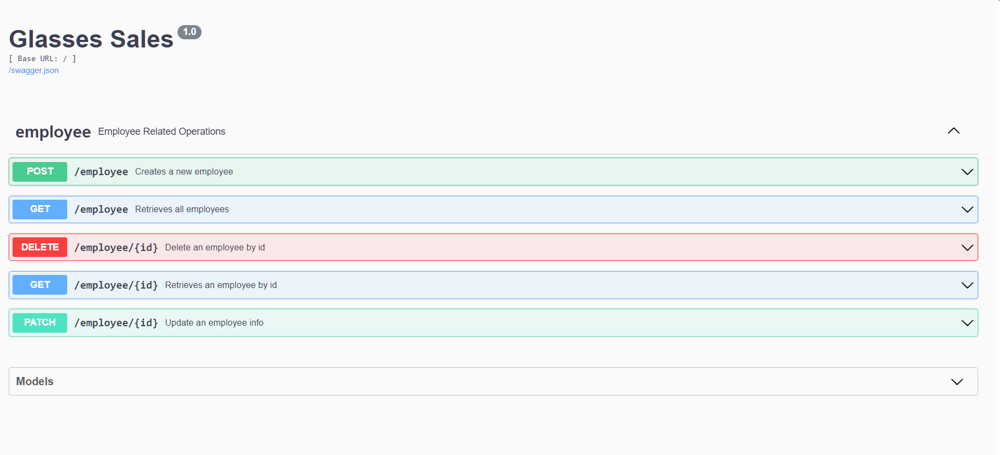

# Dashboard Glasses

Este repositório é um exemplo de backend que utiliza várias tecnologias abordadas durante um programa de pós-graduação da PUCRS. O projeto abrange conceitos como a construção de APIs REST, Docker, Testes de Integração (com o uso de Mocks), CI (utilizando GitHub Actions), ORM e Banco de Dados Relacional (PostgreSQL e migrações usando Alembic), além de princípios de Clean Architecture e Arquitetura Hexagonal.

## Descrição Geral
Neste repositório é apresentado uma aplicação em Flask (Python) integrada a um banco de dados PostgreSQL executado em um contêiner Docker. A aplicação expõe diversos endpoints que permitem a interação com a API por meio dos verbos GET, POST, DELETE e PATCH e que podem ser testados através da interface Swagger exposta através do pacote flask-restx.

Além disso, neste repositório foram configuradas Ações e Gatilhos para disparar o CI, passando pelos testes de integração até o upload da imagem no DockerHub.

## Rodando em Ambiente de Desenvolvimento

Para rodar em ambiente de desenvolvimento basta executar:

    docker-compose -f docker-compose.dev.yml up --build

Esse compose irá levantar um banco de dados postgres executar as migrações e iniciar a api na porta 5151.

Para acessar a interface swagger e testar é só abrir no navegador http://localhost:5151

## Rodando em Ambiente de Produção
Requisitos:
- Serviço de banco de dados rodando e disponível.

Para rodar em ambiente de produção ajustar a variavel de ambiente DATABASE_URI no docker-compose.prod.yaml e executar:

    docker-compose -f docker-compose.dev.yml pull
    docker-compose -f docker-compose.dev.yml up

Para acessar a interface swagger e testar é só abrir no navegador http://localhost:5151.